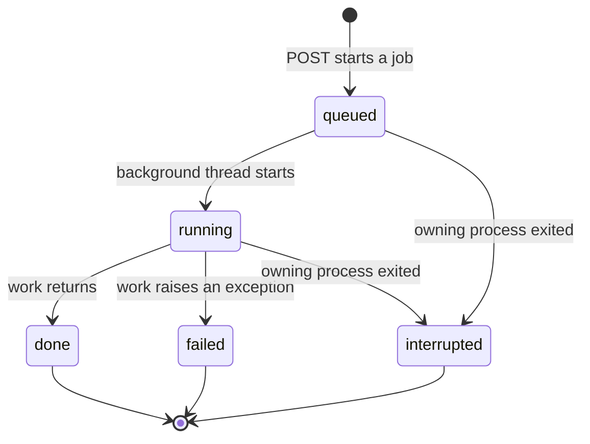

# HTTP API

The server (`python -m inquest serve`) exposes JSON endpoints under `/api` and serves the
built web interface at `/`. Long-running work runs in a background thread and returns a job
identifier; poll `GET /api/jobs/{job_id}`. One job runs per paper at a time; a second request
returns `409`.

While a paper's job is `queued` or `running`, a new job request for that paper returns `409`.

## Status and corpus

| Method | Path | Result |
|---|---|---|
| GET | `/api/status` | Language-model availability, sandbox backend, worker settings, run counters |
| GET | `/api/papers` | Every paper with its summary, latest verdicts and active job |
| GET | `/api/papers/{id}` | One paper with its metadata |
| POST | `/api/papers` | Register a paper (multipart: `repo_url`, and `pdf` or `pdf_url`; optional `title`, `paper_date`, `paper_id`). Starts extraction and the Cartographer |
| DELETE | `/api/papers/{id}` | Remove a registered paper |

## Claims and adapters

| Method | Path | Result |
|---|---|---|
| GET | `/api/papers/{id}/claims?source=hand\|extracted` | Claims with spans, and the extraction report |
| PUT | `/api/papers/{id}/claims_source` | Choose which claim set analyses use (`{"source": "hand"}`) |
| POST | `/api/papers/{id}/extract` | Run span-verified extraction |
| GET | `/api/papers/{id}/adapter` | Adapter, its origin and the Cartographer report |
| PUT | `/api/papers/{id}/adapter` | Store a human edit and validate it by execution |
| POST | `/api/papers/{id}/cartographer` | Draft and validate an adapter |

## Analysis

| Method | Path | Result |
|---|---|---|
| POST | `/api/papers/{id}/analyze` | Start an analysis (`{"deviations": "hand" \| "finder", "seeds": 20}`, both optional) |
| GET | `/api/jobs/{job_id}` | Stage states, progress, run, cache and re-score counters, log |
| GET | `/api/papers/{id}/jobs` | Recent jobs for a paper |
| GET | `/api/papers/{id}/analysis` | The latest complete analysis document |
| GET | `/api/papers/{id}/verdicts` | `ClaimVerdict[]` |
| GET | `/api/papers/{id}/witness` | Witness summaries per configuration, with self-checks |
| GET | `/api/papers/{id}/stated_vs_observed` | Each stated parameter beside its observation |
| GET | `/api/claims/{id}/{claim_id}/evidence` | Claim, analysis details, code references and run identifiers |
| GET | `/api/claims/{id}/{claim_id}/spec` | Specification sweep and SCI |

## Evidence sources

| Method | Path | Result |
|---|---|---|
| GET | `/api/pdf/{id}/page/{n}.png?x0=&y0=&x1=&y1=&zoom=` | Rendered page with the evidence box drawn |
| GET | `/api/pdf/{id}/info` | Page count and sizes |
| GET | `/api/pdf/{id}/file` | The PDF |
| GET | `/api/code/{id}?path=&line=&context=` | Source lines around a line of the pinned repository |
| GET | `/api/runs/{run_id}` | Run result, command and the tail of its output |

## Ledger, controls, evaluation, dossier

| Method | Path | Result |
|---|---|---|
| GET | `/api/consensus?model=&dataset=&metric=` | Claim ledger groups |
| GET | `/api/faults` | Control variants, the fault catalogue and coverage notes |
| POST | `/api/faults/plant` | Plant a fault (`{"paper_id": ..., "fault": "random"}`) |
| POST | `/api/faults/clean/{id}` | Create a clean control |
| POST | `/api/faults/reveal/{variant}` | Unseal a planted manifest and score the latest analysis |
| GET | `/api/eval` | Latest evaluation results |
| POST | `/api/eval/run` | Run experiments E1 to E7 |
| POST | `/api/papers/{id}/dossier` | Build the dossier PDF |
| GET | `/api/papers/{id}/dossier.pdf` | Download it |
| GET | `/api/papers/{id}/figures/{name}.png` | Static figures written by the last export |
