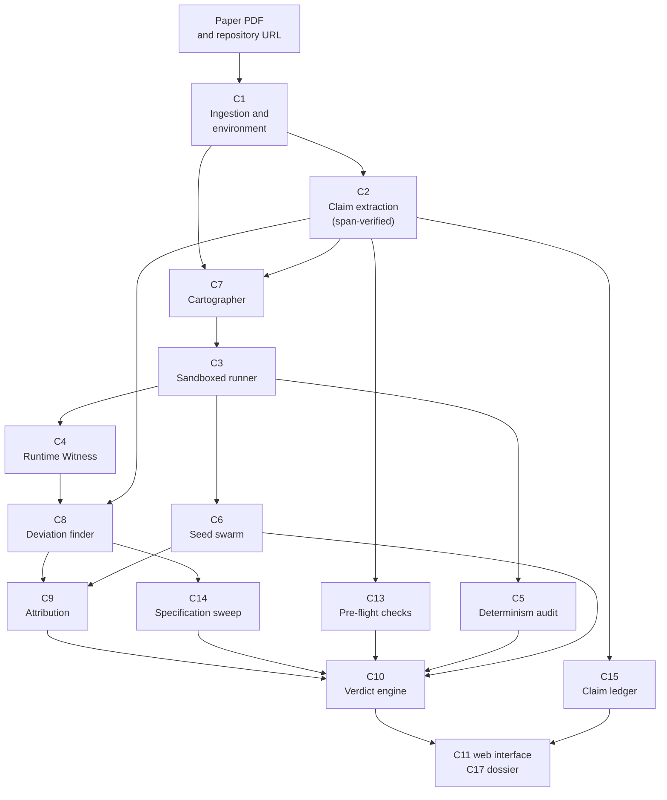
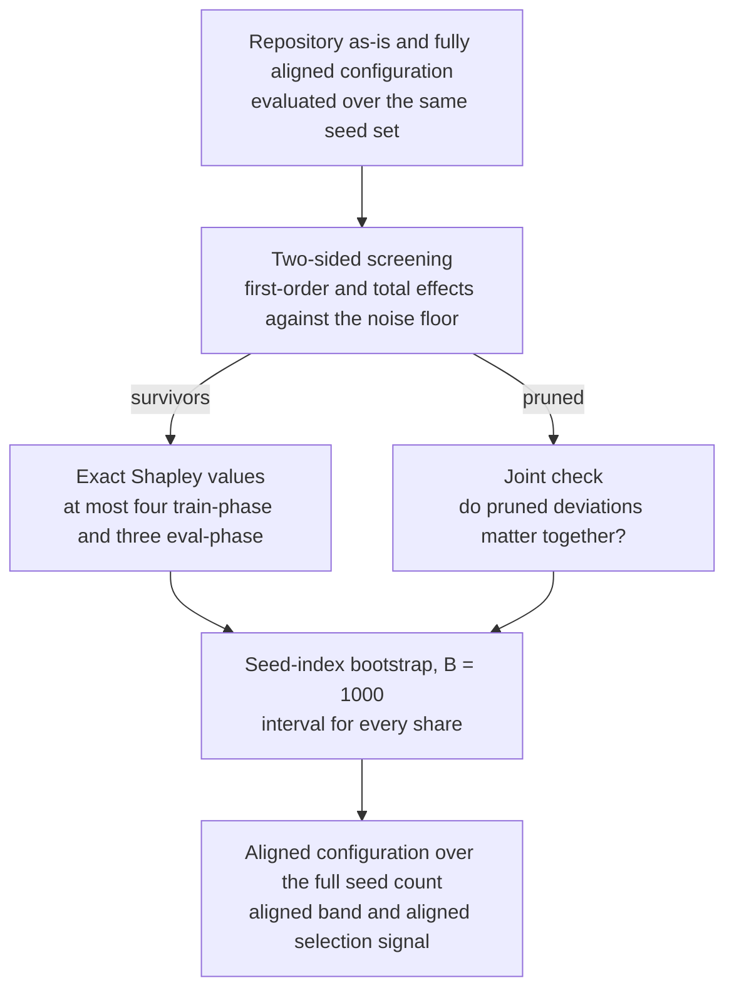
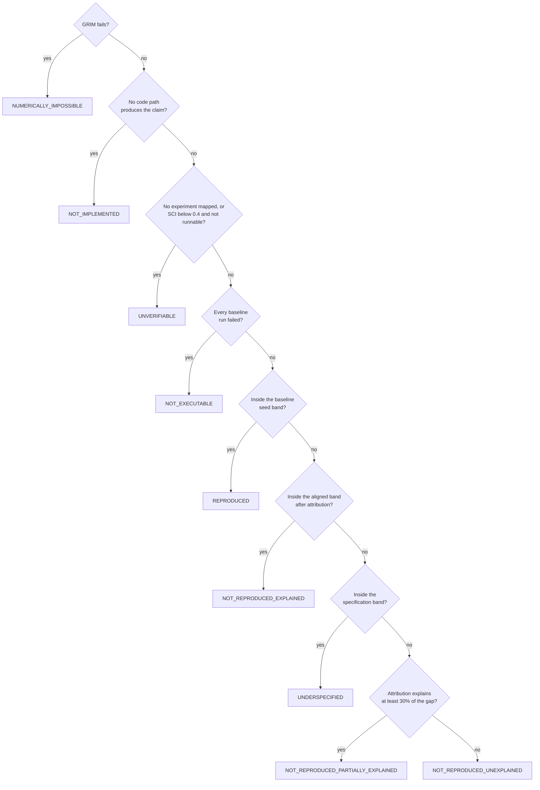

# Architecture

Inquest takes a paper PDF and the repository that implements it, runs the experiments, and
judges each numerical claim against measured error bars. Language models read and propose;
execution and statistics judge. This document describes the components, the data they
exchange, and the rules that keep model output out of verdicts.

## Pipeline

Every stage emits a result even when the next one cannot run. A repository that does not
install still yields pre-flight checks and the Specification Completeness Index; a claim
with no code path yields `NOT_IMPLEMENTED` with the reason.

## Components

| ID | Module | Responsibility |
|---|---|---|
| C1 | `env.py`, `prepare.py`, `repos.py` | Clone at a pinned commit; reconstruct the dependency set with `uv pip compile --exclude-newer <paper date>`; fetch the pinned PDF |
| C2 | `extract.py`, `pdfindex.py` | Model extraction of claims, stated parameters and procedures; span verification against page words |
| C3 | `runner.py`, `sandbox.py` | Build the command, run it in the sandbox, bind metrics, cache results by content hash |
| C4 | `witness/` | In-sandbox hooks, host-side log reading, metric binding and re-scoring |
| C5 | `determinism.py` | Same seed twice with the cache bypassed; same seed with a different hash seed |
| C6 | `swarm.py` | Seed swarm, prediction-interval band, selection signal, sequential extension |
| C7 | `cartographer.py` | Adapter drafting and executable validation; human review path |
| C8 | `deviations.py` | Stated against observed; AST findings; model-proposed name mapping and code patches |
| C9 | `attribution.py`, `patches.py` | Two-sided screening, exact Shapley, joint check, bootstrap intervals, residual |
| C10 | `verdicts.py` | Ordered rule chain and flags |
| C11 | `api.py`, `ui/`, `figures.py` | HTTP API, web interface, static figures |
| C12 | `faults.py` | Planted faults with a sealed manifest, historical faults, clean controls |
| C13 | `preflight.py` | GRIM for ML, dispersion consistency, relative-claim recomputation |
| C14 | `spec.py` | Specification sweep, specification band, plain and cost-weighted SCI |
| C15 | `ledger.py` | Claims that share a model, dataset and metric across papers |
| C16 | `evaluate.py` | Experiments E1 to E7 |
| C17 | `dossier.py` | HTML and PDF evidence dossier, provenance graph |

`schemas.py` holds the contracts between components. `store.py` persists runs, claims,
adapters, deviations, analyses, jobs, counters and the append-only provenance graph in SQLite.
`pipeline.py` orchestrates one analysis.

## Environment reconstruction

Dependencies come from requirement files, `setup.py`, and an import scan that follows the
entry point through local modules, so code the experiment never imports adds nothing.
Resolution is attempted at the paper's date. When no binary-installable set exists, the
bound moves forward in six-month steps; at each bound the interpreters 3.7, 3.8, 3.10 and
3.12 are tried oldest first. PyTorch builds come from PyTorch's own wheel archive, which
carries no upload dates, so their upper bound is taken from the package's PyPI release
history. The chosen bound, interpreter and number of days of relaxation are recorded in the
environment fingerprint and in every dossier. The resulting lock file is stored with the
paper and reused.

Python 3.7 on Windows is not distributed by `uv`; it is unpacked from the official
python.org NuGet package into the workspace.

## Sandbox

Two backends share one interface.

`docker` is the reference backend: a CPU-only container built from the paper's lock file,
`--network=none`, CPU and memory caps, the repository mounted into a throwaway container.

`local` serves hosts without a container runtime. It applies the same caps with operating
system primitives: a Windows Job Object with a memory limit and kill-on-close (POSIX
`rlimit` elsewhere), a wall-clock timeout, per-run thread caps, and a Python-level network
guard installed by the Witness. It isolates resources, not the file system. Each run records
which backend executed it.

Thread hygiene: `OMP_NUM_THREADS`, `MKL_NUM_THREADS` and `torch.set_num_threads` follow
`INQUEST_THREADS_PER_RUN`, and the worker pool is sized so that workers times threads does
not exceed the available cores.

## Runtime Witness

`witness/sitecustomize.py` is placed first on `PYTHONPATH` inside the sandbox, so Python
imports it at start-up. Hooks log and then call through; the observed program behaves as it
would without them. Libraries imported later are hooked through `wrapt` post-import hooks.
The shim stays compatible with Python 3.7 because it runs inside era-appropriate
environments.

| Record | Source |
|---|---|
| `ARGS` | `argparse` resolved namespace, every action with its flags and default, and which values were set explicitly |
| `SEED_CALL` | `random.seed`, `numpy.random.seed`, `numpy.random.default_rng`, `torch.manual_seed`, `torch.cuda.manual_seed*` |
| `DETERMINISM_FLAG` | `torch.use_deterministic_algorithms`, the injected setting, and the state at exit |
| `METRIC_CALL` | scikit-learn metric functions and repository-defined metric functions named in the adapter, with inputs retained for re-scoring |
| `SPLIT_CALL` | `train_test_split` and the common splitter classes |
| `OPTIMIZER`, `SCHEDULER`, `DATALOADER` | constructor arguments and effective values |
| `PATCH_HIT` | probe lines inserted above patched code |

Each record carries the repository `file:line` that made the call. Metric inputs are kept in
memory and the last two calls per call site are written at exit, which keeps per-epoch
validation calls cheap.

Metric binding: a claim's metric is bound to the witnessed call whose return value matches
the printed final metric within half a unit of its last printed digit. When the expected
function never produced the printed value, the binding falls back to whichever witnessed
call did, so a swapped metric function is observed rather than assumed.

Self-check: re-scoring the bound call's inputs with the witnessed definition must reproduce
the witnessed value to 1e-9. When it does not, eval-phase re-scoring is disabled for that
paper and the dossier says so.

Hash seed: `PYTHONHASHSEED` follows the run seed. Each seed is therefore a reproducible draw
of the per-process hash randomisation an unconfigured Python 3 process would receive, and the
determinism audit can test hash sensitivity separately.

## Runner and cache

The cache key is the SHA-256 of the paper identifier, the environment lock digest (or image
digest), the repository commit, the code patch hash, the fault hash, the canonical
configuration, the seed, the hash seed override and the adapter's command fields. Every run
passes through the cache; only the determinism audit bypasses it. Code patches are applied to
a copy of the repository keyed by the patch hash, built under a lock and moved into place
atomically.

## Deviations and patches

A patch is a dictionary with configuration keys (passed as command-line flags), `code`
(find and replace edits, with an optional probe), `metric` (an eval-phase definition applied
to captured predictions) and optional explicit `expect` entries. A patch is accepted only
when a smoke run shows the intended change in the Witness: the argument value, the optimizer
value, or the probe firing. Deviations without a verified patch are reported as findings and
never enter attribution.

Patches come from three sources, tried in order. A configuration flag is used when the Witness
shows that setting it changes the observation. When the observation comes from a literal in an
optimizer call (for example a hardcoded weight decay that overrides the flag), the AST gives the
literal's exact source and line, and it is replaced with the stated value. Otherwise the language
model proposes find and replace edits. Every patch, whatever its source, keeps the observation
that evidenced the deviation as its expectation, so a code patch is accepted only when the
Witness sees the intended value, not merely when the patched line runs.

Each deviation records the configurations it was observed in and the value observed in each.
Attribution and the specification sweep for a claim use only deviations observed in that
claim's configuration, plus those that apply everywhere (code, metric and hand-authored
patches). In a control, an observation the unmodified repository shares is part of the
reference and is excluded.

## Attribution

1. The repository as-is and the fully aligned configuration are evaluated over the same seed
   set (three seeds, paired, when repeated runs agree; five seeds, unpaired, otherwise).
2. Each deviation's first-order effect and total effect are compared with a noise floor. For a
   train-phase deviation it is `tau = 1.96 * s * sqrt(2 / k)`, where `s` is the seed standard
   deviation measured by the swarm. An eval-phase deviation re-scores the same runs, so its
   effect is a paired difference and its floor is `1.96 * sd(d) / sqrt(k)`, where `d` are the
   per-run differences. Without this, a metric-definition change in a noisy repository would be
   screened out by run-to-run variance it is not subject to.
3. Exact Shapley values are computed over at most four train-phase and three eval-phase
   survivors. Eval-phase coalitions re-score captured predictions and cost no training.
4. The joint check evaluates whether pruned deviations matter together.
5. A bootstrap over seed indices (B = 1000) gives an interval for every share. Shares are
   expressed as fractions of the gap only when the gap exceeds `2 * tau`.
6. The aligned configuration is run over the full seed count to produce the aligned band and
   the aligned selection signal.

## Verdicts

The engine evaluates rules in a fixed order and records the rule path.

| Order | Verdict | Condition |
|---|---|---|
| 1 | `NUMERICALLY_IMPOSSIBLE` | GRIM fails against the observed or stated test-set size |
| 2 | `NOT_IMPLEMENTED` | No code path produces the claim |
| 3 | `UNVERIFIABLE` | No experiment mapped, or SCI below 0.4 with no runnable mapping |
| 4 | `NOT_EXECUTABLE` | Every baseline run failed |
| 5 | `REPRODUCED` | Reported value inside the baseline seed band |
| 6 | `NOT_REPRODUCED_EXPLAINED` | Reported value inside the aligned band after attribution |
| 7 | `UNDERSPECIFIED` | Reported value inside the specification band |
| 8 | `NOT_REPRODUCED_PARTIALLY_EXPLAINED` | Attribution explains at least 30% of the gap |
| 9 | `NOT_REPRODUCED_UNEXPLAINED` | Otherwise |

Flags: `NON_DETERMINISTIC`, `HASH_SEED_SENSITIVE`, `SELECTION_SIGNAL` (at least ten implied
attempts on the aligned distribution when available), `PRUNED_JOINT_EFFECT`,
`NON_TOGGLABLE_DEVIATIONS`, `WITNESS_PARTIAL`.

## Statistics

| Quantity | Definition |
|---|---|
| Seed band | `mean +/- t(0.975, n - 1) * s * sqrt(1/m + 1/n)`, with `m` the number of runs the paper averages |
| Noise floor | `tau = 1.96 * s * sqrt(2 / k)` |
| Shapley value | `phi_i = sum over S of |S|! (n - |S| - 1)! / n! * [v(S + i) - v(S)]` |
| Share interval | 2.5 and 97.5 percentiles of `phi_i` over a seed-index bootstrap, B = 1000 |
| Selection signal | `k >= ln 2 / -ln(1 - p_hi)`, `p_hi` the one-sided 95% Clopper-Pearson upper bound |
| GRIM | a value is achievable if some integer `k` rounds `100 k / (m N)` to it at the printed decimals |
| Specification band | union of the seed bands of every swept configuration |
| Cost-weighted SCI | stated parameters weigh one seed standard deviation each; a swept omission weighs its measured cost in seed standard deviations |

Specification sweeps run three seeds per alternative. Their bands use the run-to-run
standard deviation from the twenty-seed baseline swarm, which assumes an alternative shifts
the mean rather than the spread.

## Language-model boundary

Three places call a model: claim extraction, the Cartographer, and the deviation finder's
name mapping and code patches. All use schema-constrained output. Their outputs are checked
by span verification, executable adapter validation, and Witness-verified patches
respectively. `verdicts.py` imports no model code.

## Schema extensions

The contracts follow section 2 of the prototype PRD. Additive extensions: several metrics per
run (`AdapterSpec.metrics`, `RunResult.metrics`), per-claim mappings (`AdapterSpec.claim_map`),
repository-relative `PYTHONPATH` entries, the interpreter version, `RunRequest.hash_seed`,
the `PATCH_HIT` Witness record, and descriptive fields on deviations and verdicts (label,
source, note, alternatives, reasons).
