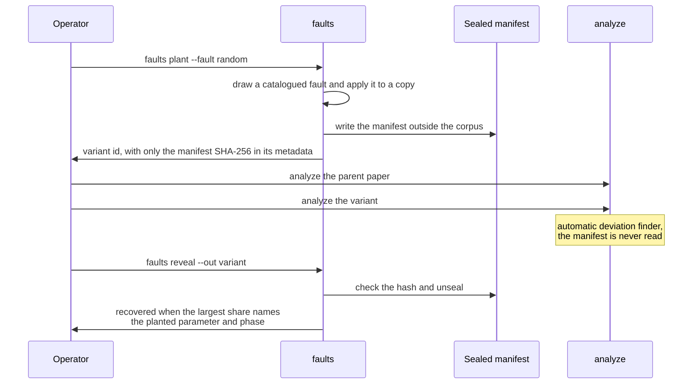

# Evaluation

`python -m inquest eval all` runs experiments E1 to E7 and writes `eval/results.json` and
`eval/results.md`. The harness reuses cached runs, so it is inexpensive once the analyses
exist. Results are reported as measured, including misses. Rows for experiments that have
not run are marked as such rather than filled in.

## Experiments

| ID | Question | Method | Reported |
|---|---|---|---|
| E1 | How well does extraction recover the claims? | Span-verified extraction on each curated paper, compared with the hand-authored `claims.json` | Precision and recall of (dataset, metric, value) tuples; span-verification rate |
| E2 | Can the Cartographer map a repository it has not seen? | Adapters drafted for registered papers and validated by execution | First-attempt validation rate; human edits required |
| E3 | Does attribution recover a known cause? | Faults planted blind with a sealed manifest; clean controls | Top-1 accuracy; absolute error between the Shapley share and the single-fault effect measured over 20 seeds; false-positive rate on clean controls |
| E4 | Is the selection signal calibrated? | Pool of 60 seeds of the GCN repository; reported values drawn as the best of k from seeds 0 to 39, estimated from 20 fresh draws of seeds 40 to 59 | How often the lower bound holds against the pool's empirical tail probability; how often the signal stays silent |
| E5 | How fragile is a single-run verdict? | Pairs of single runs from the same pool against a fixed tolerance around the reported value | Fraction of pairs that disagree |
| E6 | What did the analyses cost? | Runner counters | Runs requested and executed, cache hits, eval re-scores, wall time |
| E7 | Does the Witness see what the program computed? | Re-scoring captured predictions with the witnessed definition | Agreement with the witnessed value to 1e-9 |

## Controls

Controls are variant papers created from a curated paper and written into the workspace
(`.inquest/variants/<id>/`, with the metadata, claims and the modified repository copy). They
are generated artifacts and are recreated with the commands below. They share the curated
paper's PDF, stated parameters and environment. Their claim values are replaced by the unmodified repository's
mean over seeds 0 to 19, so any gap a control shows comes from the control itself. The claim
text in each control says so, and every dossier of a control carries the same note.

**Planted faults.** `faults plant --fault random` draws one catalogued fault that applies to
the repository, applies it to a copy, writes the manifest outside the corpus and records only
its SHA-256 in the variant's metadata. The analysis uses the automatic deviation finder and
never reads the manifest. `faults reveal` checks the hash and scores the latest analysis:
the fault counts as recovered when the largest attributed share names a deviation of the
planted parameter and phase.



| Fault | Mechanism | Applies to |
|---|---|---|
| `metric_swap` | The reported metric is computed with a different function (weighted F1 instead of accuracy; AUC instead of average precision) | SGC, VGAE |
| `epoch_drift` | The epoch default differs from the paper | GCN, SGC |
| `weight_decay_hardcoded` | A literal weight decay in the optimizer call replaces the argument | GCN |
| `lr_hardcoded` | A literal learning rate in the optimizer call replaces the argument | SGC |

`unstratified` and `warmup_removed` from the strategy catalogue have no site in the curated
repositories, which contain no `train_test_split` call and no learning-rate scheduler.

**Historical faults.** `faults history --fix-commit <sha>` checks out the parent of a commit
that fixed a result-changing bug; the fix diff is the ground truth, and nobody planted it. The
curated evaluation uses one: gae-pytorch commit `3a98122` ("fix loss function"). Before it, the
reconstruction loss computed the negative term as `log(sigmoid(1 - x))` where
`log(1 - sigmoid(x))` is meant. The historical control runs the parent commit on the VGAE Cora
claims. No Witness hook observes a loss function, so this control tests whether the platform
detects a gap it cannot attribute and labels it as unexplained rather than inventing a cause.
The other repositories' histories were checked: SGC's recorded preprocessing fix concerns the
Reddit dataset, which is not distributed with the repository, and gae-pytorch's later "fix"
commit (`c0b95ca`) changes a label array whose length is always equal to the one it replaces.

**Clean controls.** Unmodified copies. The expected outcome is `REPRODUCED` with no attributed
share.

## Recreating the controls

The evaluation uses these controls. Blind plants draw their fault from the seeded random
generator, so the same seed selects the same fault without the operator choosing it.

```bash
python -m inquest faults plant --paper wu2019-sgc --fault random --seed 7 --out wu2019-sgc~blind-a
python -m inquest faults plant --paper kipf2017-gcn --fault random --seed 11 --out kipf2017-gcn~blind-b
python -m inquest faults plant --paper wu2019-sgc --fault metric_swap --out wu2019-sgc~metric-swap
python -m inquest faults plant --paper kipf2016-vgae --fault metric_swap --out kipf2016-vgae~metric-swap --claims C-01,C-02
python -m inquest faults history --paper kipf2016-vgae --fix-commit 3a98122 --out kipf2016-vgae~hist-3a98122 --claims C-01,C-02
python -m inquest faults clean --paper wu2019-sgc
python -m inquest faults clean --paper kipf2017-gcn
```

Each control is then analysed with `python -m inquest analyze <id>` after its parent, because
a control excludes deviations its parent's latest analysis already shows. The VGAE controls are
limited to the Cora claims because a VGAE run takes 150 to 330 seconds on the reference CPU.

## Unplanted cases

The GCN repository is a real, unplanted case: its README states that it is not intended to
reproduce the paper's numbers, and the analysis measures how far it is from them and which
differences matter. The VGAE repository is a third-party reimplementation whose seed argument
is parsed but never used.
